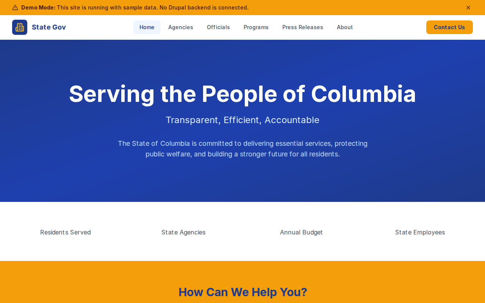

# Decoupled State Gov

A state government website starter built with Decoupled Drupal and Next.js. Designed for state governments, executive offices, and public agencies that need to publish agency directories, official profiles, government programs, and press releases.



## Features

- **Agencies** - State department and agency profiles with head officials, contact info, and service descriptions
- **Officials** - Elected and appointed official profiles with positions, offices, and biographical information
- **Government Programs** - Public programs and initiatives with eligibility, budgets, and agency affiliations
- **Press Releases** - Official announcements with categories, media contacts, and featured flags
- **Homepage** - Hero section, state statistics, featured agencies, and citizen services CTA
- **Static Pages** - About, contact, and informational pages

## Quick Start

### 1. Clone the template

```bash
npx degit nextagencyio/decoupled-state-gov my-state-gov
cd my-state-gov
npm install
```

### 2. Run interactive setup

```bash
npm run setup
```

This interactive script will:
- Authenticate with Decoupled.io (opens browser)
- Create a new Drupal space
- Wait for provisioning (~90 seconds)
- Configure your `.env.local` file
- Import sample content

### 3. Start development

```bash
npm run dev
```

Visit [http://localhost:3000](http://localhost:3000)

---

## Manual Setup

If you prefer to run each step manually:

<details>
<summary>Click to expand manual setup steps</summary>

### Authenticate with Decoupled.io

```bash
npx decoupled-cli@latest auth login
```

### Create a Drupal space

```bash
npx decoupled-cli@latest spaces create "My State Gov"
```

Note the space ID returned (e.g., `Space ID: 1234`). Wait ~90 seconds for provisioning.

### Configure environment

```bash
npx decoupled-cli@latest spaces env 1234 --write .env.local
```

### Import content

```bash
npm run setup-content
```

This imports:
- Homepage with state statistics and CTAs
- 4 Agencies (Health & Human Services, Education, Transportation, Environmental Protection)
- 4 Officials (Governor, Lt. Governor, Secretary of State, Attorney General)
- 4 Government Programs (Medicaid Expansion, Universal Pre-K, Road Improvement, Clean Energy)
- 3 Press Releases (budget proposal, Medicaid milestone, bridge repair funding)
- 2 Static Pages (About, Contact)

</details>

## Content Types

### Agency
- Title, Body
- Head Official
- Phone, Email
- Website URL
- Agency Image
- Agency Type (taxonomy)

### Official
- Title (name), Body (bio)
- Position / Title
- Agency (taxonomy)
- Email, Phone
- Office Location
- Photo

### Government Program
- Title, Body
- Agency (taxonomy)
- Eligibility criteria
- Budget allocation
- Program Area (taxonomy)
- Program Image

### Press Release
- Title, Body
- Featured Image
- Category (taxonomy)
- Featured flag
- Contact Name, Contact Email

### Basic Page
- Title, Body

## Customization

### Colors & Branding
Edit `tailwind.config.js` to customize colors, fonts, and spacing. The default theme uses navy blue and amber tones for an authoritative, trustworthy government aesthetic.

### Content Structure
Modify `data/state-gov-content.json` to add or change content types and sample content.

### Components
React components are in `app/components/`. Update them to match your state's branding guidelines.

## Demo Mode

Demo mode allows you to showcase the application without connecting to a Drupal backend. It displays mock content for the homepage, agencies, officials, programs, and press releases.

### Enable Demo Mode

Set the environment variable:

```bash
NEXT_PUBLIC_DEMO_MODE=true
```

Or add to `.env.local`:
```
NEXT_PUBLIC_DEMO_MODE=true
```

### What Demo Mode Does

- Shows a "Demo Mode" banner at the top of the page
- Returns mock data for all GraphQL queries
- Displays sample agencies, officials, programs, and press releases
- No Drupal backend required

### Removing Demo Mode

To convert to a production app with real data:

1. Delete `lib/demo-mode.ts`
2. Delete `data/mock/` directory
3. Delete `app/components/DemoModeBanner.tsx`
4. Remove `DemoModeBanner` from `app/layout.tsx`
5. Remove demo mode checks from `app/api/graphql/route.ts`

## Deployment

### Vercel (Recommended)
[](https://vercel.com/new/clone?repository-url=https://github.com/nextagencyio/decoupled-state-gov)

Set `NEXT_PUBLIC_DEMO_MODE=true` in Vercel environment variables for a demo deployment.

### Other Platforms
Works with any Node.js hosting platform that supports Next.js.

## Documentation

- [Decoupled.io Docs](https://www.decoupled.io/docs)
- [Next.js Documentation](https://nextjs.org/docs)
- [Drupal GraphQL](https://www.decoupled.io/docs/graphql)

## License

MIT
